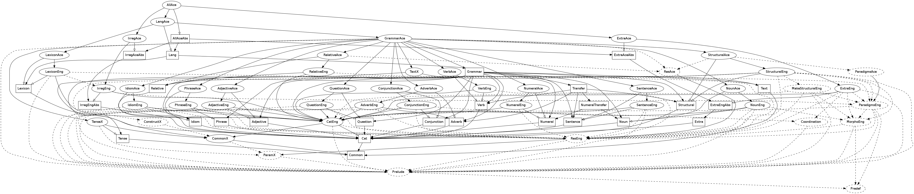

ACE Resource Grammar
====================

This resource grammar inherits nearly everything from the English library, 
but serves as a place where ACE-specific modifications can be made cleanly.

The deviations from the English resource grammar are:

- `whom` has been replaced with `who`
- removal of comma `,` between an NP and its relative clause

**Inheritence hierarchy**

**Changelog**

- 2012-04-23 (`a8e4745`): Re-implemented ACE RG as descendent of English rather
than an individual library.
